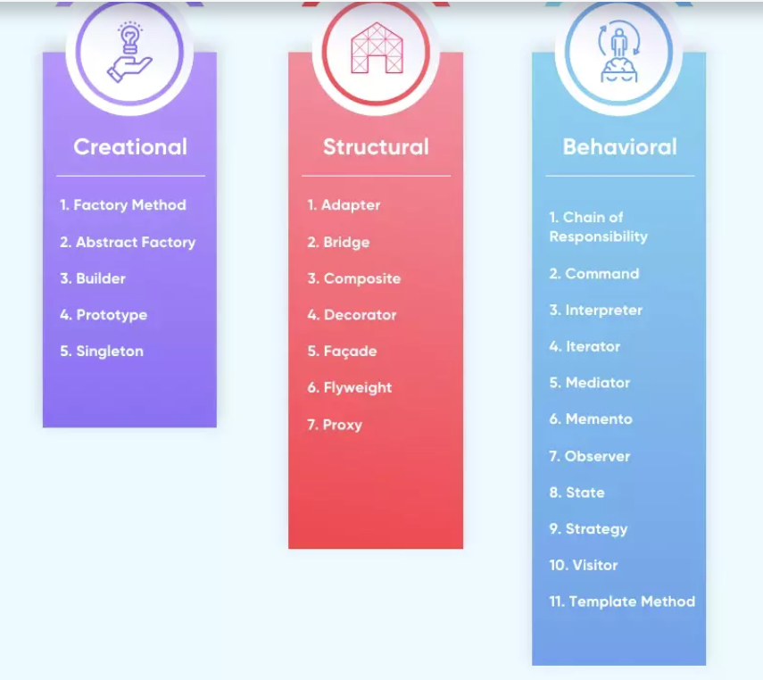

All Common Design Pattern

1. Creational Design Patterns
A creational design pattern deals with object creation and initialization, providing guidance about which objects are created for a given situation. These design patterns are used to increase flexibility and to reuse existing code.

   - Factory Method: Creates objects with a common interface and lets a class defer instantiation to subclasses.
   - Abstract Factory: Creates a family of related objects.
   - Builder: A step-by-step pattern for creating complex objects, separating construction and representation.
   - Prototype: Supports the copying of existing objects without code becoming dependent on classes.
   - Singleton: Restricts object creation for a class to only one instance.

2. Structural Design Patterns
A structural design pattern deals with class and object composition, or how to assemble objects and classes into larger structures.

   - Adapter: How to change or adapt an interface to that of another existing class to allow incompatible interfaces to work together.
   - Bridge: A method to decouple an interface from its implementation.
   - Composite: Leverages a tree structure to support manipulation as one object.
   - Decorator: Dynamically extends (adds or overrides) functionality.
   - Façade: Defines a high-level interface to simplify the use of a large body of code.
   - Flyweight: Minimize memory use by sharing data with similar objects.
   - Proxy: How to represent an object with another object to enable access control, reduce cost and reduce complexity.

3. Behavioral Design Patterns
A behavioral design pattern is concerned with communication between objects and how responsibilities are assigned between objects.

- Chain of Responsibility: A method for commands to be delegated to a chain of processing objects.
- Command: Encapsulates a command request in an object.
- Interpreter: Supports the use of language elements within an application.
- Iterator: Supports iterative (sequential) access to collection elements.
- Mediator: Articulates simple communication between classes.
- Memento: A process to save and restore the internal/original state of an object.
- Observer: Defines how to notify objects of changes to other object(s).
- State: How to alter the behavior of an object when its stage changes.
- Strategy: Encapsulates an algorithm inside a class.
- Visitor: Defines a new operation on a class without making changes to the class.
- Template Method: Defines the skeleton of an operation while allowing subclasses to refine certain steps.

4. Why Do We Need Design Patterns?
- Design patterns offer a best practice approach to support object-oriented software design, which is easier to design, implement, change, test and reuse. These design patterns provide best practices and structures.
  1. Proven Solution
  Design patterns provide a proven, reliable solution to a common problem, meaning the software developer does not have to “reinvent the wheel” when that problem occurs.

  1. Reusable
  Design patterns can be modified to solve many kinds of problems – they are not just tied to a single problem.

  1. Expressive
  Design patterns are an elegant solution.

  1. Prevent the Need for Refactoring Code
  Since the design pattern is already the optimal solution for the problem, this can avoid refactoring.

  1. Lower the Size of the Codebase
  Each pattern helps software developers change how the system works without a full redesign. Further, as the “optimal” solution, the design pattern often requires less code.

  ref: https://www.netsolutions.com/insights/software-design-pattern/