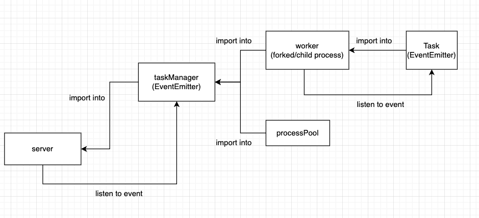

# 08-cpu-bound

https://app.diagrams.net/#G1QzAexLGFcKlpJoIZ1ccB3D0VdAiPO_Qf




This sample demonstrates how to run a CPU-bound task in Node.js
using setImmediate or multiple processes.

To start the server, run:

```shell script
  node index.mjs
```

Then try to send one or more request to trigger the subset v0 task:

```shell script
 curl -G http://localhost:8081/subsetSum --data-urlencode "data=[116,119,101]" --data-urlencode "v0=0"


  curl -G http://localhost:8081/subsetSum --data-urlencode "data=[116,119,101,101,-116,109,101,-105,-102,117,-115,-97,119,-116,-104,-105,115]" --data-urlencode "v0=0"
```

While a subset v0 task is running, you can check the responsiveness of the server with a command like this:

```shell script
  curl -G http://localhost:8081
```

If the subset v0 takes too long on your machine or is too fast for checking the responsiveness of the server, try to reduce or increase the number of items of the array given as input.

In the file `index.mjs`, try to swap between the various implementations
of the `SubsetSum` API to compare the differences in the responsiveness of the
server.

```
//import { SubsetSum } from './subsetSum.js'
//import { SubsetSum } from './subsetSumDefer.js'
//import { SubsetSum } from './subsetSumFork.js'
//import { SubsetSum } from './subsetSumThreads.js'
```
